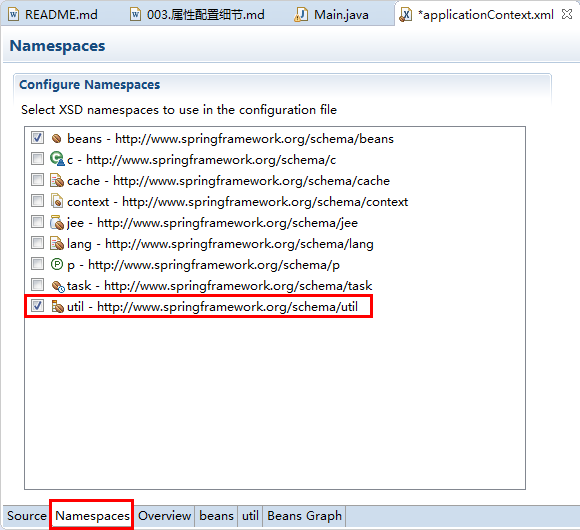
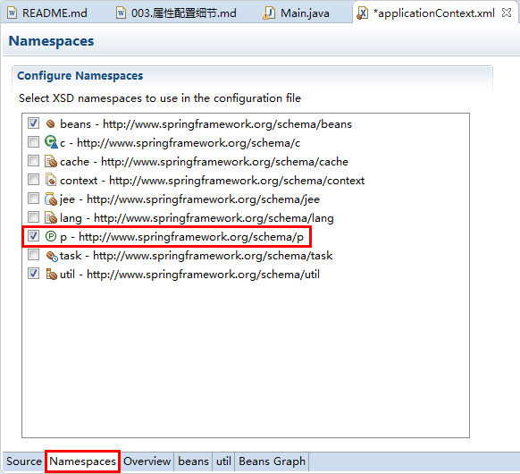

# 003.属性配置细节

* 引用其他Bean

		<bean id="person" class="com.jimmy.spring.beans.Person">
			<property name="name" value="Tom"></property>
			<property name="age" value="20"></property>
			<!-- 
				使用property的ref属性或<ref>子节点建立bean之间的引用关系
			 -->
			<property name="car" ref="car"></property>
		</bean>

* 内部Bean

		<bean id="person" class="com.jimmy.spring.beans.Person">
			<property name="name" value="Tom"></property>
			<property name="age" value="20"></property>
			<!-- 
				内部Bean，不能被外部引用。
			 -->
			<property name="car">
				<bean class="com.jimmy.spring.beans.Car">
					<constructor-arg value="Ford" type="java.lang.String"></constructor-arg>
					<constructor-arg value="Changan" type="java.lang.String"></constructor-arg>
					<constructor-arg value="200000" type="double"></constructor-arg>
				</bean>
			</property>
		</bean>

* null值

		<bean id="person" class="com.jimmy.spring.beans.Person">
			<property name="name" value="Jerry"></property>
			<property name="age" value="15"></property>
			<!-- 
				赋值null
			 -->
			<property name="car"><null/></property>
		</bean>

* 级联属性

		<bean id="person" class="com.jimmy.spring.beans.Person">
			<property name="name" value="Tom"></property>
			<property name="age" value="20"></property>
			<!-- 
				级联属性赋值
				必须要有相应的setter方法
			 -->
			<property name="car" ref="car"></property>
			<property name="car.price" value="350000"></property>
		</bean>

* 集合属性

		<bean id="richPerson" class="com.jimmy.spring.beans.RichPerson">
			<property name="name" value="Mike"></property>
			<property name="age" value="28"></property>
			<!-- 
				使用<list>节点为List类型的属性赋值
				<ref>指定对其他Bean的引用
				<bean>指定内部Bean的定义
			 -->
			<property name="cars">
				<list>
					<ref bean="car"/>
					<bean class="com.jimmy.spring.beans.Car">
						<constructor-arg value="Ford" type="java.lang.String"></constructor-arg>
						<constructor-arg value="Changan" type="java.lang.String"></constructor-arg>
						<constructor-arg value="200000" type="double"></constructor-arg>
					</bean>
				</list>
			</property>
		</bean>	

数组的赋值和List一样，使用<list>节点

java.util.Set的赋值与List类似，使用<set>节点

* Map属性

		<bean id="richPerson2" class="com.jimmy.spring.beans.RichPerson2">
			<property name="name" value="Rose"></property>
			<property name="age" value="22"></property>
			<!-- 
				使用<map>和<entry>子节点为Map类型的属性赋值
			 -->
			<property name="cars">
				<map>
					<entry key="AA" value-ref="car"></entry>
					<entry key="BB">
						<bean class="com.jimmy.spring.beans.Car">
							<constructor-arg value="Ford" type="java.lang.String"></constructor-arg>
							<constructor-arg value="Changan" type="java.lang.String"></constructor-arg>
							<constructor-arg value="200000" type="double"></constructor-arg>
						</bean>
					</entry>
				</map>
			</property>
		</bean>

* Properties属性

		<bean id="dataSource" class="com.jimmy.spring.beans.DataSource">
			<!-- 
				使用<props>和<prop>子节点为Properties属性赋值
			 -->
			<property name="properties">
				<props>
					<prop key="user">root</prop>
					<prop key="password">123456</prop>
					<prop key="jdbcUrl">jdbc:mysql///test</prop>
					<prop key="driverClass">com.mysql.jdbc.Driver</prop>
				</props>
			</property>
		</bean>

* 独立集合Bean

		<!-- 
			配置独立的集合Bean，以供多个Bean进行引用，需要导入util命名空间
		 -->
		<util:list id="cars">
			<ref bean="car"/>
			<ref bean="car2"/>
		</util:list>
		
		<bean id="richPerson3" class="com.jimmy.spring.beans.RichPerson">
			<property name="name" value="Jack"></property>
			<property name="age" value="23"></property>
			<property name="cars" ref="cars"></property>
		</bean>

* p命名空间

		<!-- 
			通过p命名空间为Bean的属性赋值，需要导入util命名空间，更加简洁
		 -->
		<bean id="richPerson4" class="com.jimmy.spring.beans.RichPerson" 
			p:name="Queen" 
			p:age="18" 
			p:cars-ref="cars">
		</bean>

